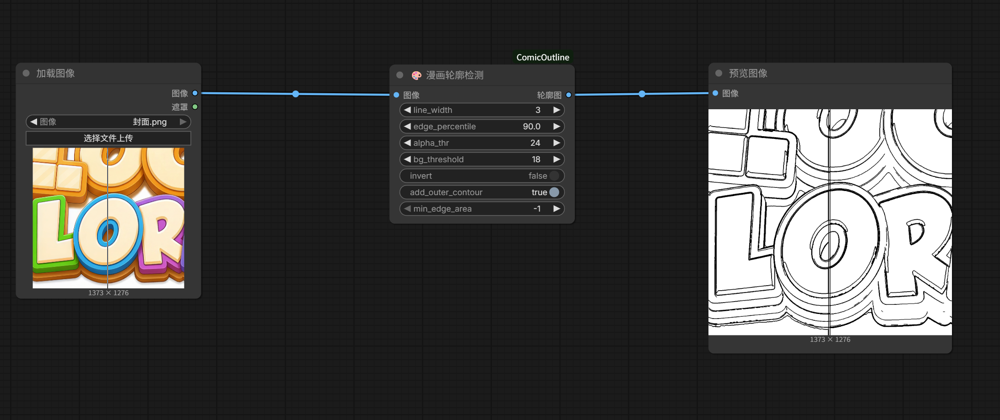

# 🎨 ComfyUI-ComicOutline

漫画/动漫轮廓检测节点 —— 多通道边缘融合 + 连通域去噪，纯 OpenCV 实现，无需下载模型。

**⚡ 单张耗时约 0.3–0.5 秒**，无需 GPU，无需下载模型。

## ComfyUI 效果



## 效果对比

| 原图 | 轮廓图 |
|------|--------|
|  |  |
|  |  |

## 算法原理

1. **前景遮罩**：自适应背景颜色检测 / Alpha 通道处理
2. **双边滤波 + 中值模糊**：去纹理去噪，保留清晰边缘
3. **亮度边缘**：自动 Canny 阈值（中位数法）
4. **颜色边界**：LAB 空间 Scharr 梯度 + 百分位阈值
5. **外部轮廓**：遮罩形态学梯度
6. **三路融合**：bitwise_or 合并 → 连通域去噪

## 安装

```bash
cd ComfyUI/custom_nodes
git clone https://github.com/dakun333/ComfyUI-ComicOutline.git
cd ComfyUI-ComicOutline
pip install -r requirements.txt
```

重启 ComfyUI 后搜索 **"漫画轮廓"** 即可找到节点。

## 节点参数

| 参数 | 类型 | 默认值 | 范围 | 说明 |
|------|------|--------|------|------|
| `图像` | IMAGE | — | — | 上游节点输入，通常接 Load Image |
| `line_width` | INT | 3 | 1–8 | 最终轮廓线条粗细，值越大线条越粗 |
| `edge_percentile` | FLOAT | 90.0 | 75–99 | 颜色边缘阈值分位数。**越高线条越干净，越低细节越多**。推荐 86–92 |
| `alpha_thr` | INT | 24 | 0–255 | 透明 PNG 的 Alpha 通道阈值，超过此值视为不透明前景 |
| `bg_threshold` | FLOAT | 18.0 | 1–100 | 非透明图的前景/背景距离阈值，值越低越容易把背景识别为前景 |
| `invert` | BOOLEAN | False | — | 开启后输出白线黑底，适合特殊合成场景 |
| `add_outer_contour` | BOOLEAN | True | — | 是否从遮罩生成外轮廓，关闭可减少非主体区域线条 |
| `min_edge_area` | INT | 自动 | -1=自动 | 最小边缘连通域面积（像素），-1 表示根据图片尺寸自动计算。增大可去除更多噪点 |

### 参数调优建议

- **线条太碎/噪点多**：调高 `edge_percentile`（92–95），或增大 `min_edge_area`
- **细节丢失太多**：调低 `edge_percentile`（84–88），减小 `min_edge_area`
- **线条太细**：增大 `line_width`（4–5）
- **透明 PNG 有白边**：降低 `alpha_thr`（10–20）
- **白色背景图被误判**：调高 `bg_threshold`（25–40）

## 工作流

```
Load Image ──► 🎨 漫画轮廓检测 ──► Save Image / Preview
```

## 依赖

- numpy
- opencv-python
- pillow

无 GPU 要求，无模型下载。
