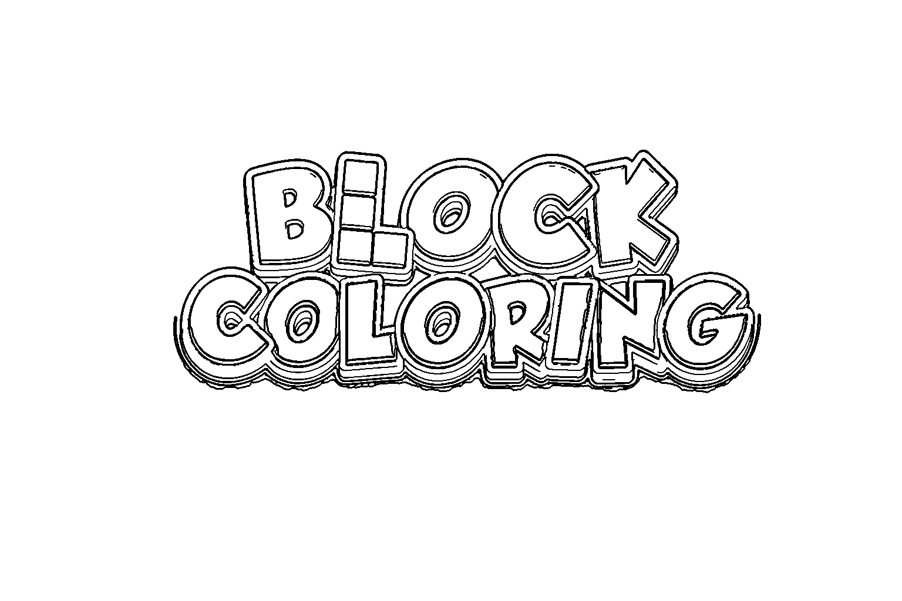

# 🎨 ComfyUI-ComicOutline

漫画/动漫轮廓检测节点 —— 多通道边缘融合 + 连通域去噪，纯 OpenCV 实现，无需下载模型。

## 效果展示

| 原图 | 轮廓图 |
|------|--------|
|  |  |
|  |  |
|  |  |
|  |  |

## 算法原理

1. **前景遮罩**：自适应背景颜色检测 / Alpha 通道处理
2. **双边滤波 + 中值模糊**：去纹理去噪，保留清晰边缘
3. **亮度边缘**：自动 Canny 阈值（中位数法）
4. **颜色边界**：LAB 空间 Scharr 梯度 + 百分位阈值
5. **外部轮廓**：遮罩形态学梯度
6. **三路融合**：bitwise_or 合并 → 连通域去噪

## 安装

```bash
cd ComfyUI/custom_nodes
git clone https://github.com/dakun333/ComfyUI-ComicOutline.git
cd ComfyUI-ComicOutline
pip install -r requirements.txt
```

## 节点参数

| 参数 | 默认值 | 说明 |
|------|--------|------|
| `图像` | — | 接入 Load Image |
| `line_width` | 3 | 线条粗细 (1-8) |
| `edge_percentile` | 90 | 越高线条越干净 (75-99) |
| `alpha_thr` | 24 | 透明 PNG Alpha 阈值 |
| `bg_threshold` | 18 | 前景背景距离阈值 |
| `invert` | False | 白线黑底模式 |
| `add_outer_contour` | True | 是否包含外轮廓 |
| `min_edge_area` | 自动 | 最小边缘面积 |

## 工作流

```
Load Image ──► 🎨 漫画轮廓检测 ──► Save Image / Preview
```

## 依赖

- numpy
- opencv-python
- pillow

无 GPU 要求，无模型下载。
